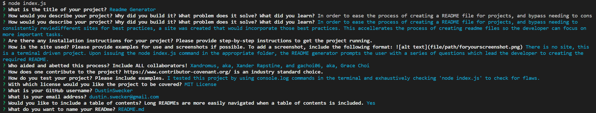
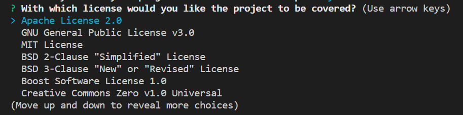
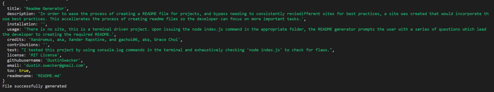

# Readme Generator  
    
## Description

In order to ease the process of creating a README file for projects, and bypass needing to consistently review different sites for best practices, a project was created that would incorporate those best practices. This accelerates the process of creating readme files so the developer can focus on more important tasks.
  
## Table of Contents 

■ [Usage](#usage)   ■ [Credits](#credits)   ■ [Testing](#testing)   ■ [Questions](#questions)   ■ [License](#license)  

## Installation

In order to use this README generator, one would need to clone the repo onto their computer, navigate to the local /Readme-gen/ folder, open the terminal, and enter 'node index.js'.

## Usage 

There is no site, this is a node.js terminal driven project. Upon issuing the 'node index.js' command in the appropriate folder, the README generator prompts the user with a series of questions:

The user is able to choose the name of the file, can include their GitHub username, as well as their email to include in the Questions section.

Additionally, the user is prompted to select a license and is provided a list of 13 options to choose from:

 When the answers are completed, an object is created from which a generator function generates the README file based on the user choices.

 

 The user is able to choose the name of the file, and can include their GitHub username, as well as their email to include in the Questions section.
 
 

## Credits 

Xandromus, aka, Xander Rapstine, and gachoi06, aka, Grace Choi

 

>

## Testing 

I tested this project by using console.log commands in the terminal and exhaustively checking 'node index.js' to check for flaws.

## Questions 

Direct questions to the following:

Github: https://github.com/DustinSwecker

Email: dustin.swecker@gmail.com
  
## License

https://opensource.org/licenses/MIT

This project uses an MIT License

